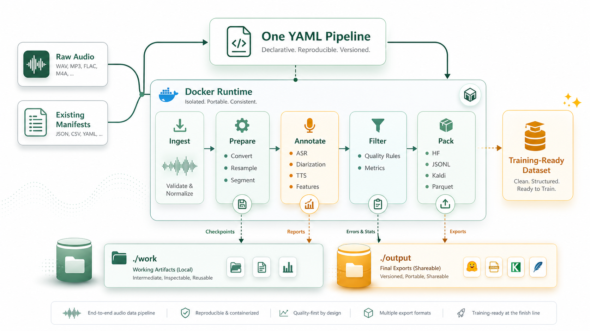

<p align="center">
  
</p>

<h1 align="center">VoxKitchen</h1>

<p align="center">
  <strong>Turn raw speech recordings into clean, inspectable training datasets.</strong>
</p>

<p align="center">
  VoxKitchen handles the repetitive audio prep around ASR, TTS, speaker
  analysis, and data cleaning: convert, segment, label, filter, and export from
  one Docker-backed YAML pipeline.
</p>

<p align="center">
  <a href="https://github.com/XqFeng-Josie/VoxKitchen/actions/workflows/ci.yml"></a>
  <a href="https://www.python.org/downloads/"></a>
  
  
  <a href="LICENSE"></a>
</p>

> **Status:** Pre-alpha. APIs and Docker image contents may change between
> releases.

Use VoxKitchen when you want to:

- turn long recordings into ASR training data;
- prepare and inspect TTS datasets;
- diarize speakers, tag languages, or run speech quality checks;
- clean, filter, and package audio without maintaining one-off scripts.

## Why VoxKitchen

Speech data preparation is usually a chain of fragile scripts: convert audio,
split speech, denoise, transcribe, diarize, filter, and export. VoxKitchen makes
that chain explicit and repeatable:

- **Docker-first execution**: prebuilt runtimes avoid local dependency conflicts.
- **One YAML pipeline**: define ingest, stages, filters, and output packs in one file.
- **51 built-in operators**: audio prep, VAD, ASR, diarization, TTS, quality metrics, and packing.
- **Resumable by design**: every stage checkpoints under `./work`.
- **Inspectable outputs**: reports, cut statistics, provenance, and per-stage errors.

## Quick Start

Requirements:

- Docker
- Python 3.10+ for the lightweight `vkit` launcher

Install `vkit` into a user-local virtual environment:

```bash
export VKIT_VERSION=v0.2.0

python -m venv ~/.venvs/voxkitchen
~/.venvs/voxkitchen/bin/python -m pip install -U pip
~/.venvs/voxkitchen/bin/python -m pip install \
  "voxkitchen @ https://github.com/XqFeng-Josie/VoxKitchen/archive/refs/tags/${VKIT_VERSION}.zip"

mkdir -p ~/.local/bin
ln -sf ~/.venvs/voxkitchen/bin/vkit ~/.local/bin/vkit
export PATH="$HOME/.local/bin:$PATH"
```

This installs only the launcher and inspection commands. Pipeline dependencies
stay inside Docker images. If `vkit` is not found in a new shell, add the
`PATH` line above to your shell startup file, such as `~/.bashrc` or
`~/.zshrc`.

Run the included demo with the smallest runtime image. No repository clone is
required; the published image includes the demo pipeline and demo audio.

```bash
vkit docker pull --tag slim
vkit docker run --tag slim examples/pipelines/demo-no-asr.yaml
vkit inspect run ./work/demo-no-asr
```

`vkit docker run` writes run artifacts under `./work` and exported datasets
under `./output` with your host user ID. It also mounts `./data` automatically
when that directory exists.

## What You Can Build

| Goal | Start with | Runtime image |
|---|---|---|
| Clean and filter raw speech audio | `vkit init my-cleaning --template cleaning` | `slim` |
| Build ASR training manifests | `vkit init my-asr --template asr` | `asr` |
| Analyze speakers and languages | `vkit init my-speakers --template speaker` | `latest` |
| Prepare TTS training data | `vkit init my-tts --template tts` | `asr` |
| Run Fish-Speech synthesis | create a pipeline with `tts_fish_speech` | `fish-speech` |

## How It Works



A pipeline is a YAML file. Each stage reads a `CutSet`, writes a checkpoint,
and passes the result to the next stage.

```yaml
version: "0.1"
name: my-pipeline
work_dir: ./work/${name}-${run_id}

ingest:
  source: dir
  args:
    root: ./data
    recursive: true

stages:
  - name: resample
    op: resample
    args: { target_sr: 16000, target_channels: 1 }

  - name: vad
    op: silero_vad
    args: { threshold: 0.5 }

  - name: asr
    op: faster_whisper_asr
    args: { model: large-v3, compute_type: float16 }

  - name: filter
    op: quality_score_filter
    args:
      conditions: ["duration > 1", "duration < 30", "metrics.snr > 10"]

  - name: pack
    op: pack_jsonl
```

Interrupted runs resume from completed checkpoints.

## Create A Project

```bash
vkit init my-project --template asr
cd my-project

# Put your audio files in ./data first.
vkit validate pipeline.yaml
vkit docker run --tag asr pipeline.yaml --dry-run
vkit docker run --tag asr pipeline.yaml
vkit inspect run work/
```

List templates:

```bash
vkit init --list-templates
```

Not sure which image a pipeline needs? Run:

```bash
vkit validate pipeline.yaml
```

It prints the recommended `vkit docker pull --tag ...` and
`vkit docker run --tag ...` commands for that YAML.

## Runtime Images

Every `vkit docker` command accepts `--tag <name>`:

| Tag | Use when | GPU | Approx. size |
|---|---|---|---|
| `slim` | CPU-friendly cleaning, VAD, quality, pack, enhancement | no | ~13 GB |
| `asr` | Faster-Whisper, FunASR, Qwen3-ASR, forced alignment | yes | ~48 GB |
| `diarize` | Pyannote speaker diarization | yes | ~32 GB |
| `tts` | Kokoro, ChatTTS, CosyVoice | yes | ~44 GB |
| `fish-speech` | Fish-Speech isolated runtime | yes | ~57 GB |
| `latest` | Mixed pipelines across ASR, diarization, TTS, or Fish-Speech | yes | ~123 GB |

Use `latest` when one pipeline mixes multiple runtime families, such as ASR
plus diarization or ASR plus TTS. Otherwise, prefer the smallest image that
contains the operators you need.

Useful checks:

```bash
vkit docker pull --tag asr
vkit docker doctor --tag asr --expect asr
vkit docker doctor --tag latest
```

## Configuration

Some operators require API tokens. Create `./.env`; `vkit docker run` passes it
into the container automatically.

```bash
cp .env.example .env
```

| Variable | Required by | Notes |
|---|---|---|
| `HF_TOKEN` | `pyannote_diarize` | Accept the pyannote model agreement on HuggingFace first. |

## Common Commands

```bash
vkit init <path> --template asr       # Scaffold a project
vkit validate pipeline.yaml           # Validate YAML and recommend an image
vkit docker run --tag asr pipeline.yaml --dry-run
vkit docker run --tag asr pipeline.yaml
vkit inspect run work/                # Stage summary
vkit inspect cuts <cuts.jsonl.gz>      # CutSet statistics
vkit inspect errors work/              # Per-stage failed cuts
vkit recipes                           # List dataset recipes
vkit docker download --tag slim librispeech --root ./data/librispeech --subsets dev-clean
vkit docker doctor --tag latest        # Check image health
```

## Documentation

- [Getting Started](docs/getting-started.md)
- [Examples & Use Cases](docs/examples.md)
- [Pipeline YAML](docs/reference/pipeline-yaml.md)
- [Recipes & Download](docs/reference/recipes.md)
- [CLI reference](docs/reference/cli.md)
- [Operators reference](docs/reference/operators.md)
- [Docker build guide](docs/docker-build.md)
- [Contributing](CONTRIBUTING.md)

## Agent Skill

The repo includes an agent-neutral VoxKitchen skill at [skill/](skill/). Claude,
Codex, and other `SKILL.md`-compatible agents can copy, symlink, or import that
folder into their own skill search path. The skill follows the Docker-first
`vkit` workflow in this README.

## License

Apache 2.0. See [LICENSE](LICENSE).
