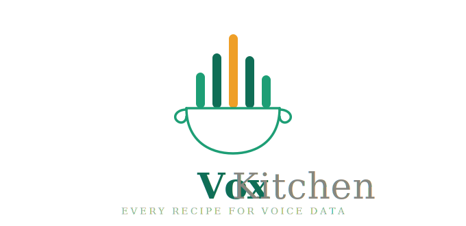

<p align="center">
  
</p>

# VoxKitchen

Turn raw speech recordings into clean, inspectable training datasets. Write one
Docker-backed YAML pipeline, run it with `vkit docker`, and get checkpoints,
reports, and exported datasets.

**52 operators** across 8 categories: audio processing, segmentation, augmentation, annotation (ASR/diarization/alignment/emotion), quality metrics, TTS synthesis, utility, and output packing.

## Get Started

- [Getting Started](getting-started.md) — install, first pipeline, inspect results
- [Examples & Use Cases](examples.md) — choose a ready-made pipeline by task
- [Data Protocol](concepts/data-protocol.md) — Recording, Supervision, Cut, CutSet, Provenance

## Tutorials

Use a template to scaffold a project for your use case:

```bash
vkit init my-project --template tts       # TTS data preparation
vkit init my-project --template asr       # ASR training data
vkit init my-project --template cleaning  # Data cleaning
vkit init my-project --template speaker   # Speaker analysis
```

- [TTS Training Data](tutorials/tts-training-data.md) — quality gate for TTS training audio: denoise, segment, transcribe, align
- [Speaker TTS](tutorials/tts-speaker.md) — synthesize text with a built-in voice (kokoro, ChatTTS, CosyVoice sft)
- [Voice Cloning & TTS](tutorials/tts-voice-cloning.md) — clone a voice from a 3–10 s reference (CosyVoice zero-shot, Fish-Speech)
- [ASR Training Data](tutorials/asr-training-data.md) — augment, transcribe, pack for training
- [Data Cleaning](tutorials/data-cleaning.md) — quality metrics, dedup, filter
- [Speaker Analysis](tutorials/speaker-analysis.md) — diarize, embed, classify

## Reference

- [Operators](reference/operators.md) — all 52 operators with config and YAML examples
- [Dataset Catalog](datasets/index.md) — dataset recipes and `vkit docker download`
- [CLI Commands](reference/cli.md) — complete CLI reference
- [Python Tools API](reference/tools-api.md) — standalone functions for quick tasks
- [Pipeline YAML](reference/pipeline-yaml.md) — YAML schema and execution model

## Quick Reference

```bash
vkit docker run --tag slim examples/pipelines/demo-no-asr.yaml --dry-run
vkit init --list-templates          # available project templates
vkit docker download --tag slim librispeech --root ./data/librispeech --subsets dev-clean
vkit docker run --tag asr pipeline.yaml --dry-run
vkit docker doctor --tag latest
```

## Links

- [Example pipelines](https://github.com/XqFeng-Josie/VoxKitchen/tree/main/examples/pipelines)
- [GitHub](https://github.com/XqFeng-Josie/VoxKitchen)
- [License](https://github.com/XqFeng-Josie/VoxKitchen/blob/main/LICENSE) (Apache 2.0)
